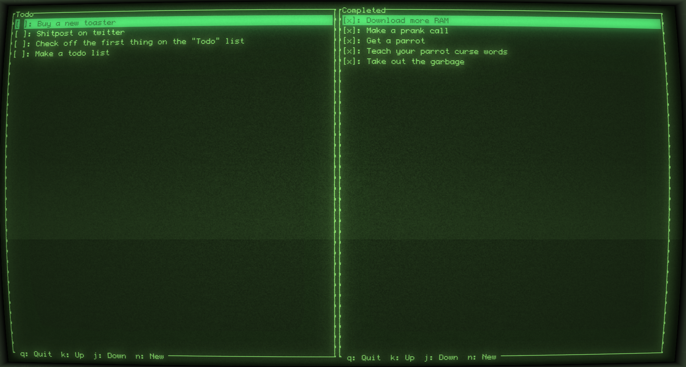

# Todo-C

*Simple NCurses TUI multi-pane todo list*

> If you're wondering how I managed to make the terminal look like that, make sure to check out [cool-retro-term](https://github.com/Swordfish90/cool-retro-term)

### TODO
- [ ] Add proper error handling for failure to parse the data file
- [ ] Add the ability to specify the location of the data file
- [ ] Disallow typing special characters in the create todo dialog
- [ ] Implement line wrapping
- [ ] Add scrolling indicators?
- [ ] Handle terminal resize
- [ ] Fix issue with writing which happens randomly where garbage characters get inserted at the end of the file
